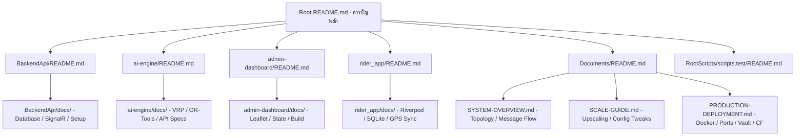

# [แผนการทำงาน] - จากทีมวางแผน

> [!NOTE]
> เอกสารนี้จัดทำโดย **ทีมวางแผน** — เพื่อวางโครงสร้างการจัดระเบียบและปรับปรุงระบบเอกสาร (Documentation Reorganization) ของทั้งโปรเจกต์ให้มีความเป็นระเบียบ เป็นสารบัญที่สืบค้นง่าย แยกแยะเอกสารระดับ Global และระดับ Sub-system ชัดเจนตามโครงสร้างจริงของซอร์สโค้ด

# Implementation Plan — Project Documentation Architecture Restructuring

---

## User Review Required

> [!IMPORTANT]
> **การปรับย้ายตำแหน่งไฟล์เอกสารเดิม (Documentation Redirection & Deprecation)**
> - ไฟล์เอกสารในไดเรกทอรี `.docs/ai-context/` เช่น `spec-backend.md`, `spec-ai-engine.md`, `spec-frontend.md`, `spec-mobile-rider.md` จะถูกคัดลอกหรือย้ายเข้าไปอยู่ในไดเรกทอรี `docs/` ของแต่ละ Sub-system นั้นๆ เพื่อความคล่องตัวในการทำงานแบบอิสระ (Decoupled Documentation)
> - ไฟล์ `README.md` ขนาดใหญ่ (49KB) ที่อยู่รูทหลักของระบบจะถูกปรับลดขนาดลง (Trimmed) ให้เหลือเพียงสารบัญอ้างอิงและภาพรวมแบบกระชับ เพื่อให้อ่านเข้าใจได้ทันทีภายใน 2 นาที

---

## Proposed Changes & Structure Catalog

---

### 1. Root Directory Setup

#### [MODIFY] [README.md](file:///c:/Users/ASUS/Desktop/Project/Delivery/README.md)
- ปรับโครงสร้างรูท `README.md` ใหม่ให้ทำหน้าที่เป็น **Master Table of Contents (สารบัญหลัก)**
- อ้างอิงลิงก์ไปยัง `README.md` ประจำระบบย่อยและแนวทางปฏิบัติระดับ Global
- ร่างสารบัญหลัก:
  - **ภาพรวมระบบและเทคโนโลยี (System Overview & Tech Stack)**
  - **ไดเรกทอรีระบบย่อย (Sub-system Catalogs)**
  - **เอกสารระบบระดับสูง (Global Systems & Operation Manuals)**
  - **ดัชนีชุดการทดสอบและสถิติ (Testing Index)**

---

### 2. Sub-system Documentation

#### 🏛️ Backend API
- **[NEW] [README.md](file:///c:/Users/ASUS/Desktop/Project/Delivery/BackendApi/README.md):** อธิบายโฟลว์การทำงานฝั่ง Backend API (.NET 8), โครงสร้าง DbContext, สถาปัตยกรรม Realtime SignalR, และ Consumer Worker บน RabbitMQ
- **[NEW] [BackendApi/docs/](file:///c:/Users/ASUS/Desktop/Project/Delivery/BackendApi/docs/):** ไดเรกทอรีเก็บเอกสารย่อย:
  - ย้ายและปรับปรุง `spec-backend.md` ไปจัดเก็บที่นี่
  - เอกสารข้อมูลการทำงานของ Entity Framework Core Migrations, Identity Management และ Database Configuration

#### 🤖 AI Engine
- **[NEW] [README.md](file:///c:/Users/ASUS/Desktop/Project/Delivery/ai-engine/README.md):** อธิบายการทำงานของ Python FastAPI Engine, การคำนวณ Distance Matrix และการทำงานของ VRP Solver ร่วมกับ Google OR-Tools
- **[NEW] [ai-engine/docs/](file:///c:/Users/ASUS/Desktop/Project/Delivery/ai-engine/docs/):** ไดเรกทอรีเก็บเอกสารย่อย:
  - ย้ายและปรับปรุง `spec-ai-engine.md` ไปจัดเก็บที่นี่
  - เอกสาร Parameter Settings สำหรับ VRP Routing Solver (เช่น CHEAPEST_ARC, Time Limit)

#### 🎨 Admin Dashboard
- **[NEW] [README.md](file:///c:/Users/ASUS/Desktop/Project/Delivery/admin-dashboard/README.md):** อธิบายภาพรวม Angular 19 Dashboard, การควบคุมสถานะจัดส่ง (SimMap), และ Leaflet Mapping component
- **[NEW] [admin-dashboard/docs/](file:///c:/Users/ASUS/Desktop/Project/Delivery/admin-dashboard/docs/):** ไดเรกทอรีเก็บเอกสารย่อย:
  - ย้ายและปรับปรุง `spec-frontend.md` ไปจัดเก็บที่นี่
  - เอกสารการจัดแจง Styles, State Management และการติดต่อผ่าน SignalR Event bindings

#### 📱 Rider Mobile App
- **[NEW] [README.md](file:///c:/Users/ASUS/Desktop/Project/Delivery/rider_app/README.md):** อธิบายโครงสร้างแอป Flutter, การทำ Offline-First SQLite Buffer, และ Background GPS Tracking
- **[NEW] [rider_app/docs/](file:///c:/Users/ASUS/Desktop/Project/Delivery/rider_app/docs/):** ไดเรกทอรีเก็บเอกสารย่อย:
  - ย้ายและปรับปรุง `spec-mobile-rider.md` ไปจัดเก็บที่นี่
  - รายละเอียดโครงสร้างตาราง SQLite (`local_database_service.dart`) และ Riverpod provider structure

---

### 3. Global Documents (@Documents)

ปรับโครงสร้างไดเรกทอรี [Documents](file:///c:/Users/ASUS/Desktop/Project/Delivery/Documents) ส่วนกลาง เพื่อเก็บงานคู่มือการขยายระบบและการ Deploy บน Production:

- **[NEW] [Documents/README.md](file:///c:/Users/ASUS/Desktop/Project/Delivery/Documents/README.md):** สารบัญหลักประจำโฟลเดอร์รวบรวมเอกสารระดับ Global
- **[NEW] [Documents/SYSTEM-OVERVIEW.md](file:///c:/Users/ASUS/Desktop/Project/Delivery/Documents/SYSTEM-OVERVIEW.md):** ภาพรวมสถาปัตยกรรม Microservices, พอร์ตต่างๆ ในโหมดพัฒนา, และ Topology การสื่อสารข้อมูลข้ามระบบ
- **[NEW] [Documents/SCALE-GUIDE.md](file:///c:/Users/ASUS/Desktop/Project/Delivery/Documents/SCALE-GUIDE.md):** คู่มือสำหรับการขยายขนาด (Upscaling):
  - จุดที่ต้องแก้ในโค้ดเพื่อเพิ่มปริมาณการรองรับผู้ใช้ (เช่น Connection Pool ขนาดใหญ่ใน `ServiceSetup.cs`)
  - การกำหนดขีดจำกัดหน่วยความจำและ CPU ของ Worker / Docker Containers
  - การจูนแต่งพารามิเตอร์ Nginx Rate Limiting สำหรับ High Load
- **[NEW] [Documents/PRODUCTION-DEPLOYMENT.md](file:///c:/Users/ASUS/Desktop/Project/Delivery/Documents/PRODUCTION-DEPLOYMENT.md):** แนวทางปฏิบัติสำหรับการนำระบบขึ้นรันจริง (Production Setup):
  - การทำ Port Isolation (ปิดพอร์ตบริการภายในไม่ให้คนนอกเข้าถึง)
  - การจัดการ Config ปลอดภัยแยก docker-compose.yml และ docker-compose.override.yml
  - การตั้งค่า SSL/TLS บน Nginx Proxy และ Nginx Rate-Limit rules
  - การตั้งค่า CDN/Cloudflare WAF และการกำหนด Rate limit ตั้งแต่ขอบเน็ตเวิร์ก

---

### 4. Test Suite Index & Documentation

#### [NEW] [README.md](file:///c:/Users/ASUS/Desktop/Project/Delivery/RootScripts/scripts.test/README.md)
- สร้างดัชนีและคู่มือการทดสอบระดับละเอียดสำหรับทีมพัฒนาและ QA:
  - **แผนผังความเชื่อมโยงในการทดสอบ (Testing Map)**
  - **รายละเอียดหมวดหมู่การทดสอบ:**
    - **C# Unit Tests:** ระบุไฟล์เทสในโฟลเดอร์ `BackendApi.UnitTests/` เช่น `DispatchServiceTests.cs` (เทสโฟลว์การแจกจ่ายงาน), `RedisLockServiceFallbackTests.cs` (เทสระบบล็อคสำรอง)
    - **C# Integration Tests:** ระบุไฟล์เทสในโฟลเดอร์ `BackendApi.IntegrationTests/` เช่น `DispatchInjectOrderTests.cs` (การคำนวณ ETA แบบสะสมและ rollback)
    - **Python AI Engine Tests:** ระบุไฟล์เทสในโฟลเดอร์ `ai-engine.tests/` เช่น `test_vrp_solver.py` (เทสคำนวณเส้นทาง OR-Tools)
    - **Load / Stress Tests:** รายละเอียดสคริปต์ใน `load-test/` และโครงสร้างโฟลเดอร์เก็บล็อกผลทดสอบใน `Test_Breaking-Point/LogsTest/` ที่แยกตามวันที่
  - **คำสั่งสำหรับการรันการทดสอบ (Command Executions):** รวบรวมคำสั่งสำหรับการรันแบบ Local, Dockerized และคำสั่งเก็บ Docker Metrics

---

## Verification Plan

### Manual Verification
- ตรวจสอบว่าทุกลิงก์อ้างอิงของเอกสารรูปแบบ `file:///` สามารถคลิกเข้าถึงและแก้ไขได้สะดวกจริงผ่านหน้าต่างบอร์ดพัฒนา
- ตรวจสอบความถูกต้องของการกระจายหัวข้อเอกสาร ไม่ให้อลหม่านหรือซ้ำซ้อนกัน
