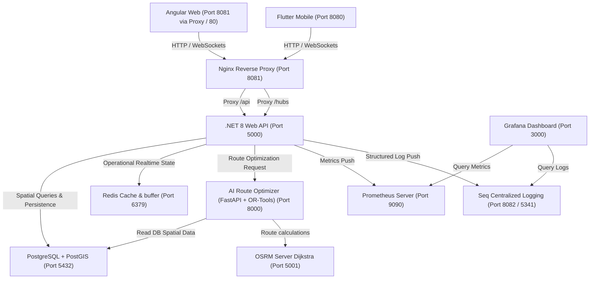

# Delivery

วิธ๊ใช้ OpenAPI Generator
# 1. เปิด Backend ก่อน (VS2022 หรือ dotnet run)
# 2. จากนั้นรัน:
    cd admin-dashboard
    npm install   # (ครั้งแรก เพื่อลง openapi-generator-cli)
    npm run generate:api


# คู่มือการใช้งานและตั้งค่าระบบจัดส่งอัจฉริยะ (Smart Delivery Routing System)
> [!IMPORTANT]
> เอกสารฉบับนี้เป็นคู่มือเชิงลึกเกี่ยวกับการตั้งค่าตัวแปรสภาพแวดล้อม (Environment Variables), โครงสร้างพอร์ตของแต่ละบริการ (Service Port Mappings), สถาปัตยกรรมระบบ (Architecture) และขั้นตอนการใช้งานระบบสังเกตการณ์ (Observability) รวมถึงการทำ Stress/E2E Simulation เพื่อเตรียมพร้อมสำหรับสภาวะการทำงานจริงแบบ Production-Grade

---

## 1. ภาพรวมสถาปัตยกรรมระบบ (System Architecture)

ระบบจัดส่งอัจฉริยะแบบเรียลไทม์ได้รับการออกแบบโดยใช้สถาปัตยกรรม **Docker-based Microservices** โดยมีการแยกส่วนการทำงานอย่างเป็นเอกเทศ แต่ทำงานประสานร่วมกันผ่านโปรโตคอลมาตรฐาน:



### หน้าที่และการประสานงานของแต่ละ Layer
1. **Frontend Layer**:
   - **Angular Web Dashboard (`frontend` - Port 8081)**: หน้าจอแอดมินสำหรับเฝ้าดูการทำงานของระบบแบบเรียลไทม์ การจับคู่ไรเดอร์ และดูตำแหน่งพิกัด GPS บนแผนที่
   - **Flutter Web Rider App (`rider-app` - Port 8080)**: หน้าจอสำหรับคนขับในการรับข้อเสนองานจากระบบเรียลไทม์ผ่าน SignalR และนำทางตามเส้นทางถนนจริง
2. **Reverse Proxy & Routing Layer (`nginx-proxy` - Port 8081)**:
   - ทำหน้าที่จัดการเส้นทางคำขอ (Traffic Routing) โดยส่งสายส่งสัญญาณเชื่อมต่อไปยัง frontend หรือ backend
   - ป้องกันและจัดการปัญหาเรื่อง **Cross-Origin Resource Sharing (CORS)** เพื่อให้มั่นใจว่าเบราว์เซอร์จะไม่บล็อกทราฟฟิก
3. **Core Processing Layer (`backend` - Port 5000)**:
   - ขับเคลื่อนด้วย **.NET 8** รองรับทราฟฟิกระดับสูงและการเชื่อมต่อแบบ Persistent Conn ด้วย SignalR
   - ควบคุมสิทธิ์การเข้าถึง (Auth JWT), การจัดการข้อมูลหลัก (Master Data - CRUD) และระบบจัดการสถานะคำสั่งซื้อ
4. **AI & Routing Engine Layer**:
   - **FastAPI Routing (`ai-service` - Port 8000)**: ฝั่งประมวลผลอัลกอริทึมค้นหาเส้นทางแบบ Vehicle Routing Problem (VRP) ด้วย **Google OR-Tools**
   - **OSRM Server (`osrm` - Port 5001)**: ให้บริการวิเคราะห์และถอดรหัสเส้นทางตามโพลีไลน์พิกัดทางภูมิศาสตร์ของแผนที่อุดรธานี
5. **Data Storage & Cache Layer**:
   - **PostgreSQL + PostGIS (`db` - Port 5432)**: แหล่งความจริงถาวร (Persistent Truth) เก็บพิกัดและประมวลผลเชิงพื้นที่ด้วย **SRID 4326**
   - **Redis Storage (`redis` - Port 6379)**: ทำหน้าที่รักษา Operational State แบบเรียลไทม์ เช่น พิกัดตำแหน่ง GPS ล่าสุด และการล็อกการเสนอราคาไรเดอร์เพื่อป้องกัน Race Condition
6. **Observability Stack (Seq, Prometheus, Grafana)**:
   - ติดตามตรวจสอบความเสถียร ประสิทธิภาพ latency ความพร้อมใช้งาน และจำนวนการเชื่อมต่อ SignalR ในแบบเวลาจริง

---

## 2. การตั้งค่าตัวแปรสภาพแวดล้อม (Environment Configuration - `.env`)

โปรเจกต์นี้มีกลไกเก็บรักษาความลับและข้อมูลการตั้งค่าผ่านไฟล์ `.env` ที่อยู่ในโฟลเดอร์หลัก (Root Directory) ของโปรเจกต์ ซึ่งมีไฟล์ต้นแบบคือ `.env.example`

### รายละเอียดตัวแปรในไฟล์ `.env`

| ตัวแปร | ตัวอย่างค่าที่กำหนด | ความหมาย / จุดประสงค์การใช้งาน |
| :--- | :--- | :--- |
| `POSTGRES_PASSWORD` | `Admin@Ts2x04_` | รหัสผ่านผู้ใช้ `postgres` ของฐานข้อมูล PostgreSQL/PostGIS (มีความสำคัญมากในการเชื่อมต่อของ .NET API และ Python AI) |
| `JWT_SECRET` | `DeliverySmartRoutingSystem_SuperSecretKey_2024` | คีย์สำหรับลงชื่อรหัส (Signature) ของ JWT Token (ต้องมีความยาวอย่างน้อย 32 ตัวอักษร เพื่อความปลอดภัยระดับมาตรฐาน HS256) |
| `REDIS_PASSWORD` | `your_secure_redis_password` | รหัสผ่านสำหรับเชื่อมต่อและรักษาความปลอดภัยของ Redis (ถ้าปล่อยว่างไว้ ระบบ Docker จะเชื่อมต่อแบบ No Auth ภายใน Docker Network) |
| `SEQ_API_KEY` | `your_seq_api_key_here` | คีย์ API สำหรับการพิสูจน์สิทธิ์ของระบบเก็บล็อกอย่างเป็นศูนย์กลาง (Seq) ในการส่ง Structured Logs จาก Serilog |

### ขั้นตอนการตั้งค่า `.env`
1. ทำการสร้างไฟล์ `.env` จากตัวอย่างไฟล์ `.env.example`:
   ```bash
   cp .env.example .env
   ```
2. แก้ไขข้อมูลในไฟล์ `.env` ด้วยข้อความลับที่คุณต้องการ
3. ตรวจสอบให้มั่นใจว่าไฟล์ `.env` ถูกจัดเก็บในคอมพิวเตอร์และ **จะไม่ถูกบันทึกขึ้น Git** (มีระบบป้องกันใน `.gitignore` เรียบร้อยแล้ว)

---

## 3. สรุปพอร์ตและการติดตั้งผ่าน Docker Compose (Port Mappings)

พอร์ตการสื่อสารในระบบได้รับออกแบบเพื่อหลีกเลี่ยงความขัดแย้งของพอร์ตในการติดตั้งและการรันงานบน Windows/Mac ดังนี้:

### สรุป Port Mappings ของทุกบริการ

| Service Name | Container Name | External Port | Internal Port | คำอธิบายจุดประสงค์ของบริการ |
| :--- | :--- | :---: | :---: | :--- |
| **nginx-proxy** | `delivery-nginx` | **8081** | 80 | **พอร์ตหลักสำหรับเข้าใช้งานแอปพลิเคชันผ่าน Nginx proxy** |
| **frontend** | `delivery-frontend` | **80** | 80 | Angular Admin Web Dashboard (ใช้เมื่อเชื่อมตรง) |
| **rider-app** | `delivery-rider-app` | **8080** | 80 | Flutter Rider Web App |
| **backend** | `delivery-backend` | **5000** | 80 | .NET 8 Web API, SignalR Hubs และ Swagger |
| **ai-service** | `delivery-ai` | **8000** | 8000 | FastAPI Server AI Routing Optimizer |
| **osrm** | `delivery-osrm` | **5001** | 5000 | OSRM Engine (คำนวณเส้นทางและถอดรหัสพิกัดถนน) |
| **db** | `delivery-db` | **5432** | 5432 | PostgreSQL 15 Database ที่เปิดใช้งานส่วนเสริม PostGIS |
| **redis** | `delivery-redis` | **6379** | 6379 | Redis Realtime operational database |
| **seq** | `delivery-seq` | **8082**<br>**5341** | 80<br>5341 | Centralized Logging Dashboard (พอร์ต 8082 Web, พอร์ต 5341 API) |
| **prometheus** | `delivery-prometheus` | **9090** | 9090 | Prometheus Metrics Scraper & Database |
| **grafana** | `delivery-grafana` | **3000** | 3000 | Grafana Data Visualizer and Dashboard panel |

### คำสั่งควบคุมที่ใช้บ่อย (Docker Compose CLI)

> [!TIP]
> ควรเปิดหน้าต่าง Powershell หรือ Bash ที่ Root Directory (`c:\Users\ASUS\Desktop\Project\Delivery`) ก่อนรันคำสั่งเหล่านี้

* **เปิดการรันระบบทั้งหมดในโหมดเบื้องหลัง (Background/Detached Mode):**
  ```powershell
  docker-compose up -d --build
  ```
* **ปิดการทำงานระบบทั้งหมดและลบ Containers รวมถึงเครือข่ายภายในออก:**
  ```powershell
  docker-compose down
  ```
* **ตรวจสอบสถานะสุขภาพและการทำงานของ Containers ทุกตัว:**
  ```powershell
  docker compose ps
  ```
* **เรียกดูข้อความและบันทึกประวัติการรัน (Logs) ของระบบ Backend หรือ AI Engine:**
  ```powershell
  docker compose logs -f backend
  docker compose logs -f ai-service
  ```

---

## 4. คู่มือการตั้งค่าและการใช้งานระบบสังเกตการณ์ (Observability Guide)

ระบบของเราติดตั้งอุปกรณ์สังเกตการณ์ประสิทธิภาพระดับสูงไว้ครบชุด เพื่อช่วยระบุคอขวดและตรวจสอบสถานภาพการส่งพิกัด GPS แบบวินาทีต่อวินาที

### 4.1 ตรวจดูการทำงานและรอยประวัติของโปรแกรมผ่าน Seq
- เข้าดูผ่านบราวเซอร์ที่พอร์ต: `http://localhost:8082`
- ระบบ Backend .NET 8 ได้รับการติดตั้งไลบรารี **Serilog** และทำการส่งข้อมูลในรูปแบบวัตถุโครงสร้าง (Structured JSON Logs) ไปยัง Seq โดยอัตโนมัติ
- **ตัวอย่างการสืบค้นข้อมูล (Search Queries) ใน Seq**:
  - หาเฉพาะล๊อกที่มีข้อผิดพลาด: `IsDefined(@Exception) or @Level = 'Error'`
  - ติดตามเฉพาะส่วนของ AI Optimizer: `Component = 'AiOptimizer'`
  - ติดตามเหตุการณ์จับคู่เรียลไทม์: `SourceContext = 'DeliveryBackendApi.Hubs.TrackingHub'`

### 4.2 ระบบดึงตัวชี้วัด (Prometheus Metrics)
- ตรวจสอบว่าระบบ Prometheus เริ่มต้นแล้วที่พอร์ต: `http://localhost:9090`
- ตัววัดเฉพาะทาง (Custom Metrics) ที่มีการสร้างและดักจับพิกัดในระบบ Backend API:
  - `delivery_active_signalr_connections`: จำนวนไรเดอร์ที่เชื่อมต่อใช้งานแบบเรียลไทม์อยู่ในปัจจุบัน
  - `delivery_db_latency_ms`: ความเร็วในการประมวลผลเชิงพื้นที่ของคำสั่ง SQL บน PostGIS
  - `delivery_redis_latency_ms`: ความเร็วในการตอบสนองและดึงค่าข้อมูลของ Redis Cache
  - `delivery_gps_updates_total`: ผลรวมทั้งหมดของตำแหน่งพิกัด GPS ที่ไรเดอร์ยิงเข้ามาในระบบ
  - `delivery_dispatch_queue_count`: จำนวนของคำสั่งซื้อที่ค้างอยู่ในคิวประมวลผลของระบบจัดส่ง

### 4.3 หน้าแสดงผลและกราฟความเร็ว (Grafana Integration)
- เข้าใช้งาน Grafana ได้ที่พอร์ต: `http://localhost:3000`
- บัญชีเริ่มต้นในการเข้าสู่ระบบครั้งแรก: **Username:** `admin` | **Password:** `admin` (ระบบจะแจ้งเตือนให้ทำการเปลี่ยนรหัสผ่านใหม่)
- **ขั้นตอนการสร้างและเชื่อมแหล่งข้อมูล (Data Sources Setup)**:
  1. ไปที่เมนู **Connections** -> **Data Sources** -> กดปุ่ม **Add data source**
  2. เลือกแหล่งข้อมูลประเภท **Prometheus**
  3. กรอก URL การเข้าถึง: `http://prometheus:9090` (ใช้ชื่อของเซอร์วิสภายในเครือข่าย Docker)
  4. กดปุ่ม **Save & test** เพื่อยืนยันว่าเชื่อมต่อสำเร็จ
- **ขั้นตอนการนำเข้าหรือสร้างแผงควบคุมหลัก (Dashboard Integration)**:
  - นำเข้าหน้าแดชบอร์ดต้นแบบสำหรับสังเกตการณ์โปรแกรม .NET Web API โดยเพิ่มกราฟแสดงสถานภาพ Latency ของระบบฐานข้อมูลและ Redis ตาม Custom Metrics ด้านบน

---

## 5. คู่มือการทดสอบระบบและจำลองการรับส่งเสมือนจริง (E2E & Load Testing Simulation)

เพื่อพิสูจน์การทำงานเชิงประสิทธิภาพและการรับส่งพิกัดอย่างมีสติก่อนการเปิดตัวแอปพลิเคชันไรเดอร์บนระบบมือถือจริง เรามีสคริปต์จำลองเหตุการณ์รับส่งอาหารจำลองความพร้อมทำงานครบวงจร

### 5.1 ระบบจำลองการรับส่งและกระบวนการทำงานครบวงจร (`scripts/e2e-simulator`)
สคริปต์ `simulate-e2e.js` ถูกออกแบบขึ้นมาเพื่อทำหน้าที่จำลองพฤติกรรมตั้งแต่ต้นจนจบ (End-to-End Delivery Flow) บนพิกัดแผนที่จังหวัดอุดรธานี:
1. ล็อกอินเข้าสู่ระบบแอดมิน เพื่อบันทึกร้านอาหารจำลองและสร้างออเดอร์ใหม่ขึ้นมา
2. สมัครใช้งานและรันไรเดอร์จำลองจำนวน 5-10 คน กระจายพิกัดตัวล้อมรอบร้านอาหาร
3. เชื่อมต่อไรเดอร์ทุกคนผ่าน SignalR Tracking Hub เพื่อเตรียมพร้อมส่งพิกัดแบบเรียลไทม์
4. สั่งตำแหน่ง GPS ปัจจุบันอัปเดตแบบวินาทีต่อวินาทีไปยังเซิร์ฟเวอร์
5. เมื่อมีออเดอร์เกิดขึ้น ระบบ FastAPI จะคิดคำนวณและเสนอข้อเสนอ (Offer) ผ่านช่องทาง SignalR
6. ไรเดอร์คนที่ดีที่สุดจะตอบรับงาน (`AcceptOffer`) จากนั้นจำลองทิศทางการเคลื่อนตัวไปหยิบอาหารที่ร้าน และเคลื่อนที่เดินทางไปส่งมอบให้แก่บ้านของลูกค้าจริงโดยดึงพิกัดจุดนำทางจากถนนจริงตามโปรโตคอลแผนที่ **OSRM**

#### ตัวแปรแวดล้อมที่ตั้งค่าได้ใน E2E Simulator:
- `DELIVERY_API_URL` (เริ่มต้น: `http://localhost:5000/api/v1`)
- `DELIVERY_HUB_URL` (เริ่มต้น: `http://localhost:5000/hubs/tracking`)
- `DELIVERY_OSRM_URL` (เริ่มต้น: `http://localhost:5001`)
- `DELIVERY_SIM_RIDERS` (จำนวนของไรเดอร์จำลองที่ต้องการทดสอบ)

#### วิธีการรันใช้งาน:
```powershell
# ย้ายตำแหน่งหน้าต่างคำสั่งไปยังโฟลเดอร์สคริปต์
cd c:\Users\ASUS\Desktop\Project\Delivery\scripts\e2e-simulator

# ติดตั้งแพ็กเกจเชื่อมต่อ SignalR และ Axios
npm install

# เริ่มต้นทดสอบจำลอง
node simulate-e2e.js
```

### 5.2 ระบบจำลองการทดสอบความล้าของเซิร์ฟเวอร์ (`scripts/load-test`)
สคริปต์ `simulator.js` ใช้สำหรับยิงคำขอตำแหน่งพิกัดแบบกระหน่ำพร้อมกัน (Concurrent GPS Pushing Stress Test) โดยจำลองไรเดอร์เป็นหลักร้อยคนเพื่อประเมินความสามารถในการรองรับปริมาณการทำงานของ SignalR และการจัดการแคชใน Redis

#### วิธีการรันใช้งาน:
```powershell
cd c:\Users\ASUS\Desktop\Project\Delivery\scripts\load-test
npm install
node simulator.js
```

---

## 6. แนวทางและวิธีการแก้ไขปัญหาเบื้องต้น (Troubleshooting Guide)

> [!WARNING]
> การเตรียมตัวแก้ปัญหาที่อาจเกิดขึ้นกับการทำงานร่วมกันของพอร์ต บริการ และฐานข้อมูลในแต่ละสภาพแวดล้อม

### 6.1 การจัดการปัญหา CORS Error ในหน้าบราวเซอร์
* **สาเหตุ**: เนื่องจาก Angular Dashboard และบริการอื่นๆ รันผ่านพอร์ตย่อยของ Proxy (เช่น `http://localhost:8081`) แต่ตัว Backend ปฏิเสธการเข้าถึงเนื่องจากไม่อยู่ในนโยบาย CORS
* **แนวทางแก้ไขที่อัปเดตแล้ว**:
  - ทางทีมพัฒนาได้เพิ่ม `http://localhost:8081` ลงใน `Cors__AllowedOrigins` ภายใต้สภาพแวดล้อมการทำงานของบริการ `backend` ในไฟล์ `docker-compose.yml` แล้ว:
    ```yaml
    - Cors__AllowedOrigins__4=http://localhost:8081
    ```
  - ทำการเริ่มการรัน Backend ใหม่เพื่อบังคับใช้ค่า CORS ที่อัปเดตนี้:
    ```powershell
    docker compose up -d backend
    ```

### 6.2 ปัญหาเกี่ยวกับ OSRM แผนที่ถนนไม่ทำงาน (Map Data Missing)
* **สาเหตุ**: ถ้าคุณเรียกใช้งาน OSRM แล้วมีข้อความแจ้งเตือนข้อผิดพลาดเกี่ยวกับการค้นหาพิกัดถนน หรือระบบคำนวณระยะทางไม่ได้
* **แนวทางแก้ไข**:
  - โปรเจกต์นี้ต้องการแผนที่พิกัดจังหวัดอุดรธานีในการประมวลผลหลัก
  - ตรวจสอบให้มั่นใจว่าไฟล์แผนที่ `udon-thani.osrm` พร้อมใช้อยู่ในไดเรกทอรี `osrm_data/` ของเครื่องคอมพิวเตอร์ของคุณแล้ว
  - หากยังไม่มีไฟล์ดังกล่าว สามารถเรียกใช้ไฟล์สคริปต์ในการตั้งค่า OSRM แผนที่อัตโนมัติ:
    ```powershell
    powershell -ExecutionPolicy Bypass -File scripts/setup-osrm.ps1
    ```

### 6.3 ปัญหาเกี่ยวกับใบอนุญาตและการเข้าถึงพอร์ต (Port Conflicting)
* **สาเหตุ**: มีโปรแกรมจำพวกฐานข้อมูล PostgreSQL ดั้งเดิมในระบบ Windows หรือเซิร์ฟเวอร์ Redis ทั่วไปติดตั้งในระบบก่อนหน้าแล้วขัดแย้งพอร์ต
* **แนวทางแก้ไข**:
  - ตรวจสอบแผงควบคุมบริการของระบบ Windows (Services.msc) และทำการหยุดทำงานโปรแกรม PostgreSQL หรือ Redis ประจำถิ่นก่อนที่จะเริ่มต้นสั่ง `docker-compose up` ของระบบโปรเจกต์นี้


## 7. วิธีการทดสอบผลลัพธ์และตรวจสอบบริการผ่าน Docker Containers (Docker Verification Guide)

เมื่อระบบทั้งหมดรันทำงานผ่าน Docker Compose (`docker-compose up -d`) ท่านสามารถใช้เครื่องมือและช่องทางต่าง ๆ ในการตรวจสอบความสำเร็จและตรวจสอบพฤติกรรมการทำงานของระบบแต่ละส่วนได้ดังนี้:

### 7.1 สรุปการตรวจสอบผลลัพธ์ของแต่ละ Container

| บริการ (Service) | พอร์ตภายนอก (URL) | สิ่งที่ใช้ตรวจสอบ (What to Check) | วิธีการสืบค้นและจุดประสงค์ (How to View & Verify) |
| :--- | :--- | :--- | :--- |
| **nginx-proxy** | `http://localhost:8081` | หน้าเว็บแอปพลิเคชันแอดมินและการประสานงานแบบสมบูรณ์ | ทดสอบเปิดหน้าเว็บแอดมิน เพื่อตรวจสอบว่าเข้าดู Dashboard ดึงข้อมูล และเข้าสู่ระบบ (Login) ได้ปกติโดยไม่ติดปัญหาบล็อกสิทธิ์ของเบราว์เซอร์ (CORS) |
| **seq** | `http://localhost:8082` | บันทึกประวัติและข้อผิดพลาดระบบ (Structured Logs & Exceptions) | - ตรวจดูว่ามีการส่งข้อผิดพลาดเข้ามาแบบสด ๆ (Realtime Log Streaming)<br>- ค้นหาคัดกรองข้อมูลล๊อกด้วยคำสั่งสืบค้นวัตถุ เช่น `IsDefined(@Exception) or @Level = 'Error'` หรือกรองหาเหตุการณ์จับคู่: `SourceContext = 'DeliveryBackendApi.Hubs.TrackingHub'` |
| **prometheus** | `http://localhost:9090` | ตรวจสอบตัวชี้วัดประสิทธิภาพเชิงระบบ (System Custom Metrics) | - เปิดเมนู **Status** -> **Targets** เพื่อตรวจว่าตัวเก็บข้อมูลยิงดึงสำเร็จและเป็นสถานะ `UP`<br>- สืบค้นตัวชี้วัดในแท็บหลัก เช่น `delivery_active_signalr_connections` (ดูคนขับออนไลน์เสมือนจริง) หรือ `delivery_gps_updates_total` (ผลรวม GPS ticks) |
| **grafana** | `http://localhost:3000` | กราฟแผงควบคุมสังเกตการณ์เชิงสถิติ (Visualized Metrics Dashboard) | ดูการเคลื่อนไหวของเส้นกราฟวิเคราะห์ประเมิน Latency ความเร็วในการประมวลผลคำสั่งเชิงพื้นที่บน PostGIS และ Redis Cache ในแบบหน้าปัดเรียลไทม์ |
| **backend** | `http://localhost:5000/swagger` | การทำงานและขอบเขต API (Swagger Spec & API manual testing) | ทำการทดสอบยิง API หรือเรียกดูโครงสร้างโมเดล DTOs แบบ Manual ผ่านบราวเซอร์ (เช่น กดปุ่ม `Try it out` ใน Swagger API เพื่อสั่ง Login หรือสร้าง Order) |
| **ai-service** | `http://localhost:8000/docs` | อัลกอริทึมคำนวณและประมวลผลจัดเส้นทางจัดสรร VRP ด้วย OR-Tools | เปิด Swagger UI ของ FastAPI เพื่อทดสอบยิงข้อมูลพิกัดคำสั่งซื้อและจุดคนขับจำลองเพื่อส่งเข้า AI Engine ในการจัดกลุ่มเส้นทางที่ประหยัดที่สุด |
| **osrm** | `http://localhost:5001` | บริการวิเคราะห์เส้นทางแผนที่พิกัดถนนจริงของจังหวัดอุดรธานี | เปิดบราวเซอร์ทดสอบด้วย URL: `http://localhost:5001/route/v1/driving/lng,lat;lng,lat?overview=full` หากได้พิกัดถนนกลับมาเป็น JSON แสดงว่า OSRM ตัวแผนที่เมืองพร้อมวิเคราะห์ |
| **db** (PostGIS) | พอร์ตฐานข้อมูล `5432` | ฐานข้อมูลถาวรเชิงพื้นที่ (Spatial Permanent Truth) | ใช้เครื่องมือเช่น pgAdmin หรือ DBeaver เชื่อมต่อไปยัง `localhost:5432` (รหัสผ่าน: `${POSTGRES_PASSWORD}`) เพื่อดึงตรวจสอบค่าในตาราง `Shops`, `Orders` หรือ `Riders` เพื่อตรวจสอบค่า Geometry Point |
| **redis** | พอร์ตแคช `6379` | พิกัดพิกเตอร์แบบสดและสถานะชั่วคราว (Realtime Active State) | ใช้โปรแกรม RedisInsight หรือคำสั่ง CLI ในการดูแคชสด ว่าพิกัด GPS ล่าสุดของไรเดอร์จัดเก็บอย่างปลอดภัยโดยไม่รบกวนประสิทธิภาพของ Database หลัก |
| **rider-app** | `http://localhost:8080` | หน้าจอแอปพลิเคชันเสมือนบนเว็บสำหรับไรเดอร์ (Rider App Web) | หน้าจอแสดงการทำงานของคนขับในการกดยอมรับงานและส่งพิกัดจำลองไปหาแอดมิน |

### 7.2 คำสั่งคอมมานด์ไลน์ที่มีประโยชน์สำหรับการสืบค้นเชิงลึก (Developer CLI)

ท่านสามารถพิมพ์คำสั่งต่อไปนี้ใน PowerShell/Terminal เพื่อตรวจสอบระบบผ่านคอนโซลเมื่ออยู่ใน Root Directory:

1. **เช็คสถานะการขึ้นระบบและความปลอดภัยของ Containers ทั้งหมด:**
   ```powershell
   docker compose ps
   ```
2. **ดูประวัติการรัน (Logs) ของระบบหลังบ้านย้อนหลังแบบสดๆ (Realtime Log Streaming):**
   ```powershell
   # ติดตามการรับตำแหน่ง GPS และการจัดการสัญญาณ SignalR ของ .NET API
   docker compose logs -f backend
   
   # ติดตามขั้นตอนคำนวณและการจับคู่ของ Python FastAPI
   docker compose logs -f ai-service
   ```
3. **ตรวจสอบว่ามีบริการตัวใดแครช หรือไม่ยอมสตาร์ท (เช่น กรณีเช็ค Seq ก่อนหน้านี้):**
   ```powershell
   docker logs <container_name>
   # ตัวอย่าง: docker logs delivery-seq
   ```
4. **ตรวจสอบความพร้อมของระบบย่อยแบบ Endpoint API:**
   - เข้าตรวจสอบที่ URL: `http://localhost:5000/health/detail`
   - ระบบจะแสดงค่า JSON ยืนยันสุขภาพของฐานข้อมูล PostGIS, Redis Connection, SignalR State และ DispatchQueue State หากขึ้นค่า `"status": "Healthy"` แสดงว่าทำงานปกติสมบูรณ์


# rider_app
        # NOTE
        # Package versions อาจต้องปรับตาม compatibility กับ Dart SDK 3.9 ณ เวลา install จริง — จะใช้ flutter pub add ทีละตัวเพื่อให้ได้ version ที่ compatible
        # ต้องทำต่อ (Next Steps)
            # ลง Flutter SDK แล้วรัน flutter pub get
            # รัน code generation: dart run build_runner build --delete-conflicting-outputs
            # สร้าง .freezed.dart + .g.dart สำหรับ models + providers
            # รัน flutter analyze เพื่อตรวจ code quality
            # Implement UI จริง ใน feature screens (แทน placeholder)
            # เชื่อม BackendApi — ใส่ URL จริง, implement login flow, test SignalR

